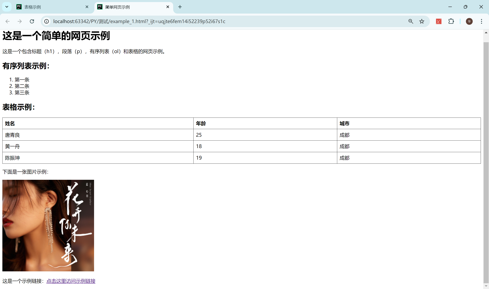
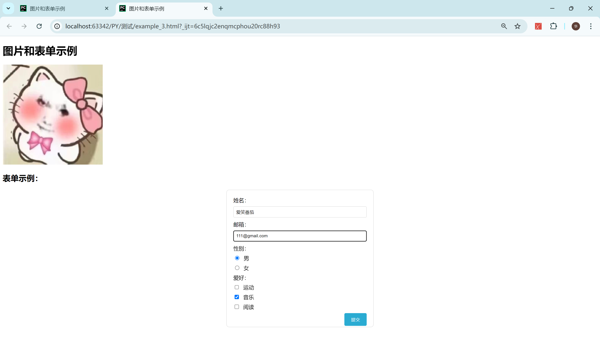
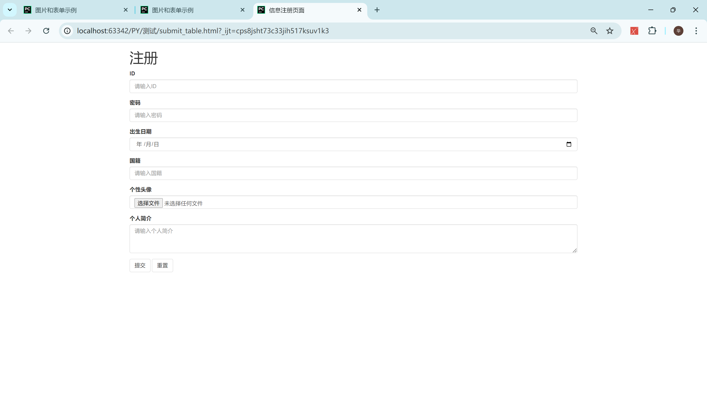

# 知识点

### HTML（超文本标记语言）

HTML 是用来构建网页结构的标记语言，以下是其基础知识和用法。

#### 1. 基础标签

- **`<div>`**：块级元素，用于容纳其他元素，无特定语义。
  ```html
  <div class="container">Content goes here</div>
  ```

- **`<span>`**：内联元素，用于包裹文本或其他内联元素，无特定语义。
  ```html
  <span class="highlight">Highlighted text</span>
  ```

- **`<p>`**：表示段落。
  ```html
  <p>This is a paragraph.</p>
  ```

- **`<h1>-<h6>`**：表示标题，`<h1>`为最高级别标题，`<h6>`为最低级别。
  ```html
  <h1>Main Title</h1>
  <h2>Sub Title</h2>
  ```

- **`<a>`**：创建链接，使用`href`属性指定目标。
  ```html
  <a href="https://www.example.com">Visit Example</a>
  ```

- **``**：嵌入图像，使用`src`属性指定图像路径。
  ```html
  
  ```

- **`<ul>`**, **`<ol>`**, **`<li>`**：无序列表、有序列表和列表项。
  ```html
  <ul>
    <li>Item 1</li>
    <li>Item 2</li>
  </ul>
  <ol>
    <li>First</li>
    <li>Second</li>
  </ol>
  ```

- **`<form>`**：创建表单，用于收集用户输入。
  ```html
  <form action="/submit" method="post">
    <input type="text" name="username">
    <button type="submit">Submit</button>
  </form>
  ```

- **`<input>`**：多用途表单输入字段，支持多种类型（`text`, `password`, `email`等）。
  ```html
  <input type="text" placeholder="Enter text">
  ```

- **`<button>`**：创建按钮。
  ```html
  <button type="button">Click Me</button>
  ```

#### 2. 表单元素

- **`<input>`**：表单输入控件，有多种类型。
  ```html
  <input type="text" placeholder="Your name">
  <input type="email" placeholder="Your email">
  ```

- **`<textarea>`**：多行文本输入控件。
  ```html
  <textarea rows="4" cols="50" placeholder="Enter your message"></textarea>
  ```

- **`<select>`** 和 **`<option>`**：下拉选择菜单。
  ```html
  <select name="options">
    <option value="1">Option 1</option>
    <option value="2">Option 2</option>
  </select>
  ```

- **`<label>`**：表单元素的标签，通过`for`属性绑定到相应的`<input>`。
  ```html
  <label for="name">Name:</label>
  <input type="text" id="name">
  ```

#### 3. 语义化标签

- **`<header>`**：定义文档或节的头部。
  ```html
  <header>
    <h1>Website Title</h1>
    <nav>
      <a href="#home">Home</a>
      <a href="#about">About</a>
    </nav>
  </header>
  ```

- **`<footer>`**：定义文档或节的页脚。
  ```html
  <footer>
    <p>&copy; 2024 Company Name</p>
  </footer>
  ```

- **`<article>`**：定义独立的内容块。
  ```html
  <article>
    <h2>Article Title</h2>
    <p>Article content goes here.</p>
  </article>
  ```

- **`<section>`**：定义文档中的节。
  ```html
  <section>
    <h2>Section Title</h2>
    <p>Section content goes here.</p>
  </section>
  ```

- **`<nav>`**：定义导航链接。
  ```html
  <nav>
    <ul>
      <li><a href="#home">Home</a></li>
      <li><a href="#services">Services</a></li>
    </ul>
  </nav>
  ```

- **`<aside>`**：定义侧边栏内容。
  ```html
  <aside>
    <h2>Sidebar</h2>
    <p>Sidebar content goes here.</p>
  </aside>
  ```

#### 4. 多媒体标签

- **`<video>`**：嵌入视频。
  ```html
  <video controls>
    <source src="movie.mp4" type="video/mp4">
    Your browser does not support the video tag.
  </video>
  ```

- **`<audio>`**：嵌入音频。
  ```html
  <audio controls>
    <source src="audio.mp3" type="audio/mpeg">
    Your browser does not support the audio element.
  </audio>
  ```

- **`<source>`**：指定媒体资源。
  ```html
  <video controls>
    <source src="movie.mp4" type="video/mp4">
    <source src="movie.ogg" type="video/ogg">
    Your browser does not support the video tag.
  </video>
  ```

- **`<canvas>`**：绘制图形的容器。
  ```html
  <canvas id="myCanvas" width="200" height="100" style="border:1px solid #000000;"></canvas>
  <script>
    var c = document.getElementById("myCanvas");
    var ctx = c.getContext("2d");
    ctx.fillStyle = "#FF0000";
    ctx.fillRect(0, 0, 150, 75);
  </script>
  ```

#### 5. SEO相关

- **`<title>`**：设置网页标题，显示在浏览器标签中，对SEO非常重要。
  ```html
  <title>Page Title</title>
  ```

- **`<meta>`**：提供关于文档的元数据。
  ```html
  <meta name="description" content="Description of the page for SEO.">
  <meta name="keywords" content="HTML, CSS, JavaScript">
  <meta name="author" content="Author Name">
  ```

- **语义化标签的使用**：有助于搜索引擎更好地理解内容结构，提高网页在搜索结果中的可见性。

### CSS（层叠样式表）

CSS 用于控制HTML元素的样式和布局。以下是CSS的基础知识和用法。

#### 1. 选择器

- **类型选择器**：选中所有特定类型的元素。
  ```css
  p {
    color: blue;
  }
  ```

- **类选择器**：选中特定类的元素。
  ```css
  .highlight {
    background-color: yellow;
  }
  ```

- **ID选择器**：选中具有特定ID的元素。
  ```css
  #main {
    width: 100%;
  }
  ```

- **后代选择器**：选中特定元素的子元素。
  ```css
  div p {
    margin: 10px;
  }
  ```

- **伪类选择器**：选中元素的特定状态（如悬停，选中等）。
  ```css
  a:hover {
    color: red;
  }
  ```

- **伪元素选择器**：选中元素的特定部分（如第一个字母，行等）。
  ```css
  p::first-line {
    font-weight: bold;
  }
  ```

#### 2. 布局

##### 盒模型

- **`margin`**：外边距。
- **`padding`**：内边距。
- **`border`**：边框。
- **`content`**：内容。

```css
.box {
  margin: 20px;
  padding: 10px;
  border: 1px solid black;
  width: 200px;
}
```

##### 定位

- **`static`**：默认定位，按正常文档流排列。
- **`relative`**：相对定位，相对于其正常位置偏移。
- **`absolute`**：绝对定位，相对于最近的已定位祖先元素偏移。
- **`fixed`**：固定定位，相对于浏览器窗口偏移。
- **`sticky`**：粘性定位，在滚动到一定位置时固定。

```css
.relative {
  position: relative;
      top: 10px;
  left: 20px;
}

.absolute {
  position: absolute;
  top: 50px;
  left: 50px;
}

.fixed {
  position: fixed;
  top: 0;
  right: 0;
}

.sticky {
  position: sticky;
  top: 0;
}
```


##### Flexbox

- **`display: flex;`**：将父容器设为flex容器。
- **主轴对齐**：`justify-content`（`flex-start`, `center`, `space-between`, `space-around`）。
- **交叉轴对齐**：`align-items`（`flex-start`, `center`, `stretch`）。
- **项目排序**：`order`属性。

```css
.container {
  display: flex;
  justify-content: space-between;
  align-items: center;
}

.item {
  order: 2;
}
```

##### Grid

- **`display: grid;`**：将父容器设为grid容器。
- **定义行列**：`grid-template-columns`和`grid-template-rows`。
- **区域**：`grid-template-areas`。
- **网格对齐**：`justify-items`和`align-items`。

```css
.grid-container {
  display: grid;
  grid-template-columns: 1fr 2fr;
  grid-template-rows: 100px auto;
  grid-template-areas:
    "header header"
    "sidebar content";
}

.header {
  grid-area: header;
}

.sidebar {
  grid-area: sidebar;
}

.content {
  grid-area: content;
}
```

##### 响应式设计

- **媒体查询**：根据不同屏幕尺寸应用不同样式。
- **视口单位**：`vw`, `vh`。
- **百分比布局**：相对于父元素的宽高。

```css
@media (max-width: 600px) {
  .responsive {
    width: 100%;
  }
}

.box {
  width: 50vw;
  height: 50vh;
}
```

#### 3. 文本样式

- **`font-family`**：设置字体。
- **`font-size`**：设置字体大小。
- **`color`**：设置字体颜色。
- **`line-height`**：设置行高。
- **`text-align`**：设置文本对齐方式。
- **`text-decoration`**：设置文本装饰（如下划线）。
- **`text-transform`**：设置文本转换（如大写）。

```css
.text {
  font-family: Arial, sans-serif;
  font-size: 16px;
  color: #333;
  line-height: 1.5;
  text-align: center;
  text-decoration: underline;
  text-transform: uppercase;
}
```

#### 4. 动画

- **`transition`**：设置过渡效果。
- **`transform`**：设置元素的变换（如旋转，缩放）。
- **`animation`**：设置动画。
- **`keyframes`**：定义动画关键帧。

```css
.transition {
  transition: all 0.3s ease;
}

.transition:hover {
  transform: scale(1.2);
}

@keyframes example {
  0% { background-color: red; }
  100% { background-color: yellow; }
}

.animate {
  animation: example 5s infinite;
}
```

#### 5. 预处理器

- **Sass**：CSS预处理器，支持变量、嵌套、混合等。
- **Less**：类似Sass的CSS预处理器。

```scss
// Sass示例
$primary-color: #333;

.container {
  color: $primary-color;

  .nested {
    margin: 10px;
  }
}
```

### JavaScript

JavaScript 是用于网页交互的脚本语言。以下是JavaScript的基础知识和用法。

#### 1. 基础语法

- **变量**：`let`, `const`, `var`。
- **数据类型**：字符串，数字，布尔值，数组，对象等。
- **运算符**：`+`, `-`, `*`, `/`, `=`, `==`, `===`等。
- **控制流**：`if`, `else`, `switch`。
- **循环**：`for`, `while`, `do-while`。

```javascript
let name = "John";
const age = 30;

if (age > 18) {
  console.log("Adult");
} else {
  console.log("Minor");
}

for (let i = 0; i < 5; i++) {
  console.log(i);
}
```

#### 2. 函数

- **函数声明**。
- **函数表达式**。
- **箭头函数**。
- **回调函数**。
- **立即执行函数（IIFE）**。

```javascript
function greet() {
  return "Hello, World!";
}

const greetExpression = function() {
  return "Hello, Expression!";
};

const greetArrow = () => "Hello, Arrow!";

(function() {
  console.log("IIFE");
})();
```

#### 3. 对象和数组

- **对象字面量**。
- **数组方法**：`map`, `filter`, `reduce`。
- **解构赋值**。
- **扩展运算符**。

```javascript
let person = {
  name: "Alice",
  age: 25
};

let numbers = [1, 2, 3, 4, 5];

let doubled = numbers.map(num => num * 2);
let filtered = numbers.filter(num => num > 2);
let sum = numbers.reduce((total, num) => total + num, 0);

let { name, age } = person;
let [first, second, ...rest] = numbers;
```

#### 4. DOM操作

- **`document.querySelector`**：选择元素。
- **`document.getElementById`**：通过ID选择元素。
- **`classList`**：操作元素的类。
- **`createElement`**：创建新元素。
- **`appendChild`**：添加子元素。
- **`innerHTML`**：设置或获取HTML内容。

```javascript
let element = document.querySelector('.my-element');
let elementById = document.getElementById('my-id');

element.classList.add('new-class');

let newElement = document.createElement('div');
newElement.innerHTML = "New Element";
document.body.appendChild(newElement);
```

# 练习1

- 用html实现课程表的设计

  ```html
  <!DOCTYPE html>
  <html lang="en">
  <head>
      <meta charset="UTF-8">
      <title>课程表</title>
      <style>
          /*设置表格样式*/
          table {
              /*合并边框*/
              border-collapse: collapse;
              /*表格宽度为100%*/
              width: 100%;
              /*设置背景颜色*/
              background-color: darksalmon;
          }
  
          th, td {
              /*单元格的边框颜色设置*/
              border: 1px solid black;
              /*单元格内边距*/
              padding: 8px;
              text-align: center; /*文本居中*/
          }
  
          th {
              background-color: #2aabd2;
          }
      </style>
      <script>
          const classTable = [
              [{"time": "第一节", "class": ""}, {"time": "8:00-8:45", "class": "数学"}, {
                  "time": "8:00-8:45",
                  "class": "语文"
              }, {"time": "8:00-8:45", "class": "英语"}, {"time": "8:00-8:45", "class": "物理"}, {
                  "time": "8:00-8:45",
                  "class": "政治"
              }, {"time": "8:00-8:45", "class": "数学"}, {"time": "8:00-8:45", "class": "自习"}],
              [{"time": "第二节", "class": ""}, {"time": "8:55-9:40", "class": "生物"}, {
                  "time": "8:55-9:40",
                  "class": "地理"
              }, {"time": "8:55-9:40", "class": "化学"}, {"time": "8:55-9:40", "class": "语文"}, {
                  "time": "8:55-9:40",
                  "class": "数学"
              }, {"time": "8:55-9:40", "class": "历史"}, {"time": "8:55-9:40", "class": "自习"}],
              [{"time": "第三节", "class": ""}, {"time": "10:00-10:45", "class": "数学"}, {
                  "time": "10:00-10:45",
                  "class": "语文"
              }, {"time": "10:00-10:45", "class": "英语"}, {
                  "time": "10:00-10:45",
                  "class": "物理"
              }, {"time": "10:00-10:45", "class": "政治"}, {
                  "time": "10:00-10:45",
                  "class": "数学"
              }, {"time": "10:00-10:45", "class": "自习"}],
              [{"time": "第四节", "class": ""}, {"time": "10:55-11:40", "class": "生物"}, {
                  "time": "10:55-11:40",
                  "class": "地理"
              }, {"time": "10:55-11:40", "class": "化学"}, {
                  "time": "10:55-11:40",
                  "class": "语文"
              }, {"time": "10:55-11:40", "class": "数学"}, {
                  "time": "10:55-11:40",
                  "class": "历史"
              }, {"time": "10:55-11:40", "class": "自习"}],
              [{"time": "第五节", "class": ""}, {"time": "12:00-12:45", "class": "数学"}, {
                  "time": "12:00-12:45",
                  "class": "语文"
              }, {"time": "12:00-12:45", "class": "英语"}, {
                  "time": "12:00-12:45",
                  "class": "物理"
              }, {"time": "12:00-12:45", "class": "政治"}, {
                  "time": "12:00-12:45",
                  "class": "数学"
              }, {"time": "12:00-12:45", "class": "自习"}],
              [{"time": "第六节", "class": ""}, {"time": "12:55-13:40", "class": "生物"}, {
                  "time": "12:55-13:40",
                  "class": "地理"
              }, {"time": "12:55-13:40", "class": "化学"}, {
                  "time": "12:55-13:40",
                  "class": "语文"
              }, {"time": "12:55-13:40", "class": "数学"}, {
                  "time": "12:55-13:40",
                  "class": "历史"
              }, {"time": "12:55-13:40", "class": "自习"}],
              [{"time": "第七节", "class": ""}, {"time": "14:00-14:45", "class": "数学"}, {
                  "time": "14:00-14:45",
                  "class": "语文"
              }, {"time": "14:00-14:45", "class": "英语"}, {
                  "time": "14:00-14:45",
                  "class": "物理"
              }, {"time": "14:00-14:45", "class": "政治"}, {
                  "time": "14:00-14:45",
                  "class": "数学"
              }, {"time": "14:00-14:45", "class": "自习"}],
              [{"time": "第八节", "class": ""}, {"time": "14:55-15:40", "class": "生物"}, {
                  "time": "14:55-15:40",
                  "class": "地理"
              }, {"time": "14:55-15:40", "class": "化学"}, {
                  "time": "14:55-15:40",
                  "class": "语文"
              }, {"time": "14:55-15:40", "class": "数学"}, {
                  "time": "14:55-15:40",
                  "class": "历史"
              }, {"time": "14:55-15:40", "class": "自习"}],
              [{"time": "第九节", "class": ""}, {"time": "16:00-16:45", "class": "数学"}, {
                  "time": "16:00-16:45",
                  "class": "语文"
              }, {"time": "16:00-16:45", "class": "英语"}, {
                  "time": "16:00-16:45",
                  "class": "物理"
              }, {"time": "16:00-16:45", "class": "政治"}, {
                  "time": "16:00-16:45",
                  "class": "数学"
              }, {"time": "16:00-16:45", "class": "自习"}],
              [{"time": "第十节", "class": ""}, {"time": "16:55-17:40", "class": "生物"}, {
                  "time": "16:55-17:40",
                  "class": "地理"
              }, {"time": "16:55-17:40", "class": "化学"}, {
                  "time": "16:55-17:40",
                  "class": "语文"
              }, {"time": "16:55-17:40", "class": "数学"}, {
                  "time": "16:55-17:40",
                  "class": "历史"
              }, {"time": "16:55-17:40", "class": "自习"}],
          ];
      </script>
  </head>
  <body>
  <h1 style="text-align: center;color: brown">清华冲刺班课程表</h1>
  <table>
      <thead>
      <tr>
          <th>节数\时间</th>
          <th>周一</th>
          <th>周二</th>
          <th>周三</th>
          <th>周四</th>
          <th>周五</th>
          <th>周六</th>
          <th>周日</th>
      </tr>
      </thead>
      <tbody>
      <tr>
          <td colspan="9" style="background-color: lightgray;">上午</td>
      </tr>
      </tbody>
  </table>
  <script>
      //循环生成每节课的行
      for (let i = 0; i < classTable.length; i++) {
          //从第六节课开始为下午
          if (i === 5) {
              const after_row = document.createElement("tr")
              const after_cell = document.createElement("td")
              after_cell.colSpan = 9   //设置单元格跨越9列
              after_cell.style.backgroundColor = "lightgrey" //背景颜色设置
              after_cell.innerHTML = "下午"
              after_row.append(after_cell)
              document.querySelector("table tbody").appendChild(after_row)
          }
          const tr = document.createElement("tr") //创建行
          for (let j = 0; j < classTable[i].length; j++) {
              const td = document.createElement("td") //创建单元格
              td.innerHTML = classTable[i][j].time + "<br>" + classTable[i][j].class //设置单元格内容
              tr.appendChild(td)  //单元格添加到行
          }
          document.querySelector("table tbody").appendChild(tr)   //将行添加到表格主体
      }
  </script>
  </body>
  </html>
  ```

  

### 效果展示


# 作业2

### 使用JS完成如下设计

- 1.输入三个整数x,y,z，请把这三个数由小到大输出。

- 2.打印出所有的“水仙花数”，所谓“水仙花数”是指一个三位数，其各位数字立方和等于该数本身。例如：153是一个“水仙花数”，因为153=1的三次方＋5的三次方＋3的三次方。

- 3.程序分析：利用for循环控制100-999个数，每个数分解出个位，十位，百位。

  ### 常规思想来写

```js
// TODO:输入三个整数,按从小到大的顺序输出
const list = [10222, 412, 666];
list.sort((A, B) => A - B)         //sort()方法用于对数组的元素进行排序
console.log(list)
console.log("----------------------------")

//TODO:函数方法写
// function sort_list(a,b,c){
//     var sort_list=[a,b,c]
//     sort_list.sort((A,B)=>A-B)
//     console.log(sort_list)
// }
// sort_list(11,9,8)

//TODO:水仙花数
//python的写法
// for i in range(100,1000):
//     a=i//100
//     b=(i//10)%10
//     c=i%10
//     if i==a**3+b**3+c**3:
//         print(i)

for (let i = 100; i < 1000; i++) {
    const a = Math.floor(i / 100);    //floor用于向下取整
    const b = Math.floor((i / 10) % 10);
    const c = i % 10;
    if (i === a ** 3 + b ** 3 + c ** 3) {
        console.log(i)
    }
}
console.log("----------------------------")

//TODO:程序分析：利用for循环控制100-999个数，每个数分解出个位，十位，百位,向下取整
for (let m = 100; m < 1000; m++) {
    const a1 = m % 10;
    const a2 = Math.floor(m / 10 % 10);
    const a3 = Math.floor(m / 100 % 10);
    console.log("数字:" + m, "百位:" + a3, "十位:" + a2, "个位:" + a1)
}
console.log("----------------------------")

//TODO:输出100-200之间不能被3整除的数
for (let l = 100; l < 200; l++) {
    if (l % 3 !== 0) {
        console.log("l=" + l)
    }
}

console.log("----------------------------")

//TODO:一张纸的厚度为0.1mm,珠穆朗玛峰的高度为8848m,问将纸折叠多少次才能超过珠穆朗玛峰的高度
let paper = 0.1, height = 8848130;
let count = 0;
while (paper < height) {
    paper *= 2
    count++
}
console.log("折叠次数为:" + count)

console.log("----------------------------")

//TODO:用1元纸币兑换1分,2分,5分的硬币,要求兑换的总数为50枚,问可以有多少中组合,每种组合对应的硬币各是多少枚
let w, e, y;
count = 0;
for (w = 0; w <= 20; w++) {
    for (e = 0; e <= 50; e++) {
        for (y = 0; y <= 50; y++) {
            if (w + e + y === 50 && 5 * w + 2 * e + y === 100) {
                console.log("w=" + w, "e=" + e, "y=" + y)
                count++
            }
        }
    }
}
console.log("共有" + count + "种组合")

console.log("----------------------------")

//TODO:function
function sum(a, b) {
    sum = a + b
    console.log("两个数的和为:" + sum)
}

sum(395655, 26675757)


// 使用 Array.from() 生成包含数字 1 到 999 的数组
let list1 = Array.from({ length: 999 }, (_, index) => index + 1);
console.log(list1);

```

### 用函数思想来写

```js
// TODO:输入三个整数,按从小到大的顺序输出
function sort_num(num1, num2, num3) {
    const list = [num1, num2, num3];  //与py的列表相似
    list.sort((A, B) => A - B)
    console.log(list)
}

sort_num(12383393, 48543958, 289342893)

console.log("----------------------------")


//TODO:水仙花数
//python的写法
// for i in range(100,1000):
//     a=i//100
//     b=(i//10)%10
//     c=i%10
//     if i==a**3+b**3+c**3:
//         print(i)

function water_hua() {
    for (let i = 100; i < 1000; i++) {
        const num4 = Math.floor(i / 100);  //Math.floor向下取整
        const num5 = Math.floor(i / 10 % 10);
        const num6 = i % 10;
        if (i === num4 ** 3 + num5 ** 3 + num6 ** 3) {
            console.log(i)
        }
    }
}

water_hua()

console.log("----------------------------")

//TODO:程序分析：利用for循环控制100-999个数，每个数分解出个位，十位，百位,向下取整
function div_num() {
    for (let l = 100; l < 1000; l++) {
        const num7 = l % 10
        const num8 = Math.floor(l / 10 % 10)
        const num9 = Math.floor(l / 100 % 10)
        console.log("数字:" + l, "百位:" + num9, "十位:" + num8, "个位:" + num7)
    }
}

div_num()

console.log("----------------------------")

//TODO:输出100-200之间不能被3整除的数
function dont_div() {
    for (let k = 100; k < 200; k++) {
        if (k % 3 !== 0) {
            console.log("k(不能被3整除的数):" + k)
        }
    }
}

dont_div()

console.log("----------------------------")

//TODO:一张纸的厚度为0.1mm,珠穆朗玛峰的高度为8848m,问将纸折叠多少次才能超过珠穆朗玛峰的高度
function div_paper() {
    let paper = 0.1;
    height = 8848000;
    count = 0
    while (paper < height) {
        paper = paper * 2
        count++
    }
    console.log("需要折叠" + count + "次")
}

div_paper()

console.log("----------------------------")

//TODO:用1元纸币兑换1分,2分,5分的硬币,要求兑换的总数为50枚,问可以有多少中组合,每种组合对应的硬币各是多少枚
function money_div() {
    let x, y, z;count=0;
    for (x = 0; x <= 20; x++) {
        for (y = 0; y <= 50; y++) {
            for (z = 0; z <= 50; z++) {
                if (x + y + z === 50 && x * 5 + y * 2 + z  === 100) {
                    console.log("1分硬币有:" +  x + "枚", "2分硬币有:" +  y + "枚", "5分硬币有:" + z + "枚")
                    count++
                }
            }
        }
    }
    console.log("有"+count+"种组合")
}
money_div()
console.log("----------------------------")

//内容比较多,运行效果是打印在控制台的,可以安装node.js解释器就能看到运行结果
```


# 作业3

```题目
创建一个简单的网页
使用HTML创建一个包含标题（h1），段落（p），和一个有序列表（ol）的网页。
表格创建

使用HTML创建一个包含以下内容的表格：
3行4列
第一行为表头（thead），包含“姓名”、“年龄”、“性别”、“城市”。
其他行为表体（tbody），可以填充一些示例数据。
图片和链接

创建一个网页，包含一个图片和一个链接。图片应该能点击跳转到另一个网页（baidu.com）。
表单创建,提交到自定义的一个连接既可
创建一个包含以下字段的表单：
姓名（文本框）
邮箱（文本框）
性别（单选按钮）
爱好（复选框）
提交按钮
```

### 练习1

```html
<!DOCTYPE html>
<html lang="en">
<head>
    <meta charset="UTF-8">
    <meta name="viewport" content="width=device-width, initial-scale=1.0">
    <title>简单网页示例</title>
    <style>
        table {
            width: 100%;
            border-collapse: collapse;
        }
        th, td {
            border: 1px solid black;
            padding: 8px;
            text-align: left;
        }
    </style>
</head>
<body>
    <h1>这是一个简单的网页示例</h1>
    <p>这是一个包含标题（h1），段落（p），有序列表（ol）和表格的网页示例。</p>

    <h2>有序列表示例：</h2>
    <ol>
        <li>第一条</li>
        <li>第二条</li>
        <li>第三条</li>
    </ol>

    <h2>表格示例：</h2>
    <table>
        <thead>
            <tr>
                <th>姓名</th>
                <th>年龄</th>
                <th>城市</th>
            </tr>
        </thead>
        <tbody>
            <tr>
                <td>唐青良</td>
                <td>25</td>
                <td>成都</td>
            </tr>
            <tr>
                <td>黄一舟</td>
                <td>18</td>
                <td>成都</td>
            </tr>
            <tr>
                <td>陈振坤</td>
                <td>19</td>
                <td>成都</td>
            </tr>
        </tbody>
    </table>
    <p>下面是一张图片示例：</p>
    

    <p>这是一个示例链接：<a href="https://baidu.com" target="_blank">点击这里访问示例链接</a></p>
</body>
</html>


```




### 练习2

```html
<!DOCTYPE html>
<html lang="en">
<head>
    <meta charset="UTF-8">
    <meta name="viewport" content="width=device-width, initial-scale=1.0">
    <title>图片和表单示例</title>
    <style>
        form {
            max-width: 400px;
            margin: 20px auto;
            padding: 20px;
            border: 1px solid #ccc;
            border-radius: 8px;
        }
        label {
            display: block;
            margin-bottom: 8px;
        }
        input[type="text"], input[type="email"] {
            width: 100%;
            padding: 8px;
            margin-bottom: 10px;
            border: 1px solid #ccc;
            border-radius: 4px;
            box-sizing: border-box;
        }
        input[type="radio"], input[type="checkbox"] {
            margin-right: 8px;
        }
        input[type="submit"] {
            background-color: #2aabd2;
            color: white;
            padding: 10px 20px;
            border: none;
            border-radius: 4px;
            cursor: pointer;
            float: right;
        }
        input[type="submit"]:hover {
            background-color: #2aabd2;
        }
    </style>
</head>
<body>
    <h1>图片和表单示例</h1>

    <a href="https://www.baidu.com" target="_blank">
        
    </a>

    <h2>表单示例：</h2>
    <form action="https://your-custom-url.com/submit" method="POST">
        <label for="name">姓名：</label>
        <input type="text" id="name" name="name" required>

        <label for="email">邮箱：</label>
        <input type="email" id="email" name="email" required>

        <label>性别：</label>
        <label><input type="radio" name="gender" value="male"> 男</label>
        <label><input type="radio" name="gender" value="female"> 女</label>

        <label>爱好：</label>
        <label><input type="checkbox" name="hobby" value="sports"> 运动</label>
        <label><input type="checkbox" name="hobby" value="music"> 音乐</label>
        <label><input type="checkbox" name="hobby" value="reading"> 阅读</label>


        <input type="submit" value="提交"><br>
    </form>
</body>
</html>

```



# 作业4

- 表单填写


```html
<!DOCTYPE html>
<html lang="en">
<head>
    <meta http-equiv="Content-Type" content="text/html; charset=UTF-8">
    <meta http-equiv="X-UA-Compatible" content="IE=edge">
    <meta name="viewport" content="width=device-width, initial-scale=1.0">
    <meta name="description" content="">
    <meta name="author" content="">
    <link rel="stylesheet" href="static/bootstrap-3.4.1-dist/css/bootstrap.min.css">
    <script src="static/jquery-3.6.0.min.js"></script>
    <script>
        function showmsg1(){alert("注册成功！");}
        function showmsg2(){alert("重置成功！");}
        $(document).ready(function(){
            $("#submit").click(function(){
                var id = $("#id").val();
                var password = $("#password").val();
                var birthday = $("#birthday").val();
                var country = $("#country").val();
                var avatar = $("#avatar").val();
                var description = $("#description").val();

                window.location.href = "show_sub.html?id=" + encodeURIComponent(id) +
                    "&password=" + encodeURIComponent(password) +
                    "&birthday=" + encodeURIComponent(birthday) +
                    "&country=" + encodeURIComponent(country) +
                    "&avatar=" + encodeURIComponent(avatar) +
                    "&description=" + encodeURIComponent(description);
            });

            $("#reset").click(function(){
                $("#id").val("");
                $("#password").val("");
                $("#birthday").val("");
                $("#country").val("");
                $("#avatar").val("");
                $("#description").val("");
            });
        }
        );
    </script>
    <title>信息注册页面</title>
</head>
<body>
    <div class="container">
        <h1>注册</h1>
        <form>
            <div class="form-group">
                <label for="id">ID</label>
                <input type="text" class="form-control" id="id" placeholder="请输入ID">
            </div>
            <div class="form-group">
                <label for="password">密码</label>
                <input type="password" class="form-control" id="password" placeholder="请输入密码">
            </div>
            <div class="form-group">
                <label for="birthday">出生日期</label>
                <input type="date" class="form-control" id="birthday" placeholder="请输入出生日期">
            </div>
            <div class="form-group">
                <label for="country">国籍</label>
                <input type="text" class="form-control" id="country" placeholder="请输入国籍">
            </div>
            <div class="form-group">
                <label for="avatar">个性头像</label>
                <input type="file" class="form-control" id="avatar" placeholder="请上传个性头像">
            </div>
            <div class="form-group">
                <label for="description">个人简介</label>
                <textarea class="form-control" id="description" rows="3" placeholder="请输入个人简介"></textarea>
            </div>
            <button type="button" class="btn btn-default" id="submit" onclick="showmsg1()">提交</button>
            <button type="button" class="btn btn-default" id="reset" onclick="showmsg2()">重置</button>
        </form>
    </div>
</body>
</html>

```



- 提交跳转显示

```html
<!DOCTYPE html>
<html lang="en">
<head>
    <meta http-equiv="Content-Type" content="text/html; charset=UTF-8">
    <meta http-equiv="X-UA-Compatible" content="IE=edge">
    <meta name="viewport" content="width=device-width, initial-scale=1.0">
    <meta name="description" content="">
    <meta name="author" content="">
    <link rel="stylesheet" href="static/bootstrap-3.4.1-dist/css/bootstrap.min.css">
    <script src="static/jquery-3.6.0.min.js"></script>
    <title>信息展示页面</title>
    <script>
        $(document).ready(function(){
            function getQueryParam(param) {
                var urlParams = new URLSearchParams(window.location.search);
                return urlParams.get(param);
            }

            var id = getQueryParam("id");
            var password = getQueryParam("password");
            var birthday = getQueryParam("birthday");
            var country = getQueryParam("country");
            var avatar = getQueryParam("avatar");
            var description = getQueryParam("description");

            $("#display").html(
                "<h3>填写的信息:</h3>" +
                "<p><b>ID:</b> " + id + "</p>" +
                "<p><b>密码:</b> " + password + "</p>" +
                "<p><b>出生日期:</b> " + birthday + "</p>" +
                "<p><b>国籍:</b> " + country + "</p>" +
                "<p><b>个性头像:</b> " + avatar + "</p>" +
                "<p><b>个人简介:</b> " + description + "</p>"
            );
        });
    </script>
</head>
<body>
    <div class="container">
        <div id="display"></div>
    </div>
</body>
</html>

```


### 字符串反转

```js
//TODO:传入Hello World 返回 "dlroW olleH"
function reverseString(str) {
    return str.split("").reverse().join("");
}

console.log(reverseString("Hello World"));


let str33 = "Hello World";
split_str33 = str33.split("") //使用split()方法将字符串分割成数组
// console.log(split_str33)
reverse_str33 = split_str33.reverse()  //使用reverse()方法将数组反转
// console.log(reverse_str33)
join_str33 = reverse_str33.join("")    //使用join()方法将数组连接成字符串
console.log(join_str33)
```


### 验证字符串

```js
//TODO:验证字符串:长度4-16,只包含数字,英文字符,下划线三种符号,首字符不能是数字
function checkString() {
    var string44 = prompt("请输入字符串")
    if (string44.length < 4 || string44.length > 16) {
        alert("字符串长度必须在4到16之间!")
    }
    if (!/^[a-zA-Z0-9_]+$/.test(string44)) {
        alert("字符串只能包含数字,英文字符和下划线!")
    }
    if (/^[0-9]/.test(string44)) {
        alert("字符串首字符不能是数字!")
    }
    if (string44.length >= 4 && string44.length <= 16 && /^[a-zA-Z0-9_]+$/.test(string44) && !/^[0-9]/.test(string44)) {
        alert("字符串验证通过!")
    }
}
checkString()
```

