# waf绕过

## waf概述

waf与firewall不同，waf针对的是应用层

waf是通过执行一系列针对http/https的安全策略来专门为web应用提供保护的一种网络安全产品

waf可以增大攻击者的攻击难度和攻击成本，当不是100%安全的

## waf分类

1.软件型waf   2.硬件型waf    3.云waf    4.网站系统内置的waf

## waf的工作流程

1.进行身份认证，先匹配白名单进行检测是否归属白名单，如果归属那么直接把请求发送到服务器

2.如果不归属白名单，它会先进行数据包解析

3.之后进入规则系统匹配，匹配是否有符合规则的请求，如果没有匹配到规则会放行到服务器

4.如果匹配到了规则会进行拦截，并弹出一个类似与系统检测url输出恶意参数

## 判断网站是否存在waf

使用sqlmap判断：

说明：使用sqlmap中自带的waf识别模块可以识别出waf的种类

用法：sqlmap -u "url" --identify-waf --batch

结果：识别出waf类型为xxx web application firewall，如果安装的waf没有特征，识别出来的就是：gener

## waf绕过常见的方法

### 大小写混合

大小写绕过用于只针对小写或大写都关键字匹配技术

出现原因：在waf里，使用的正则不完善或者是没有用大小写转换函数

用法：id=0 uNiON SelecT 1,2,3

### 替换关键字：

1.关键字双写

出现原因：利用waf的不完整性，只验证一次字符或者过滤的字符串并不完整

用法：id=0 UNIunionON SEselectLECT 1,2,3

2.同词替换：

出现原因：waf主要是针对一些特殊的关键字进行检测

用法：and和or不能使用：可以使用&&和||代替     =不能使用：可以尝试>.<     空格不能使用时：%20  ,   %09    ,     %0a    ,   %0b    ,  %0c   ,  %0d   ,   %a0   /**/       等于（=）不能使用时：like

注意：在mysql中%0a是换行，可以代替空格

### 特殊字符拼接

出现原因：把特殊字符字符拼接起来绕过waf的检测

用法：如在函数里可以用+来拼接，在MySQL中可以利用注释/**/绕过

id=1,exec(master...xp_cmdshell'net user')可以写成id=1,exec('maste'+'r...xp'+'_cmdshell'+'"net user"')

说明：master...xp_cmdshell 是一个可以执行系统命令的函数

### 编码绕过

对一些字符进行编码，常见的sql编码有unicode，HEX，URL，ascii，base64等

出现原因：利用浏览器上的进制转换或者语言编码规则来绕过waf

#### url编码

空格 %20，单引号%27，左括号%28，斜杠（/）%2f，星号（*）%2a，逗号%2c

#### unicode编码

单引号：%u0027     空格：%u0020    左括号：%u0028   右括号：%u0029

### 注释绕过（常用）

常见的注释符：// ， /**/，--+，--a

出现原因：利用语言函数特性来绕过waf 

#### 普通注释

/**/在构造的查询语句中插入注释，规避对空格的依赖或关键字识别

用法：id=1/* */UNION/ * */select 1,2,3

#### 内联注释

内联注释有一个特性/*！/只有mysql能识别（/ * ! */表示注释里面的语句会被执行）

用法：采用/*！code */来执行我们的sql语句，内联注释可以用于整个sql语句中

举例:id=1 /*!uniON */+sELEct+1,2,concat(/ *!tabLE_name */)+From/ *!information_schema  */.tabLEs/ * !where*/+/ *!table_schema */+like+database()

###   参数污染

hpp又叫重复参数污染，当同一参数出现多次，不同中间件会解析为不同的结果，如果waf只检测了同名参数中的第一个或最后一个，并且中间特性正好取与waf相反的参数，则可以成功绕过

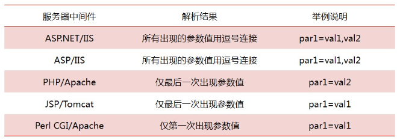

web服务器在遇到为同一个参数赋值不同数值时，会将他们连接起来，攻击者通过这个方法来绕过黑名单

举例：id=select 1,2,3 from table 可以写成 id=select 1&id=2,3 from table

说明：1.这不属于黑名单中的模式，不会触发黑名单的拦截功能

2.由于web程序会采取连接操作，即将&符号前后的内容连接，因此sql注入行为能够被执行

### 缓冲区溢出

缓冲区溢出用于绕过waf，许多waf是c语言写的，而c语言自身没有缓冲区保护机制，因此如果waf在处理测试向量时超出了其缓冲区长度，就会引发bug从而实现绕过

举例：id=1 and (select 1)=(select 0xAAAAA*1000 more A)+unioN+SleCt+1,2,database(),4,5,version(),user() --+

说明：示例0xA*1000是指后面A重复1000次

### 分块传输绕过

当我们将传输的内容分块时，处理后的http请求由于和已知的payload相差较大，所以可以起到一定的绕过waf的效果

举例：正常输入id=1 and 1=2,会被安全狗拦住

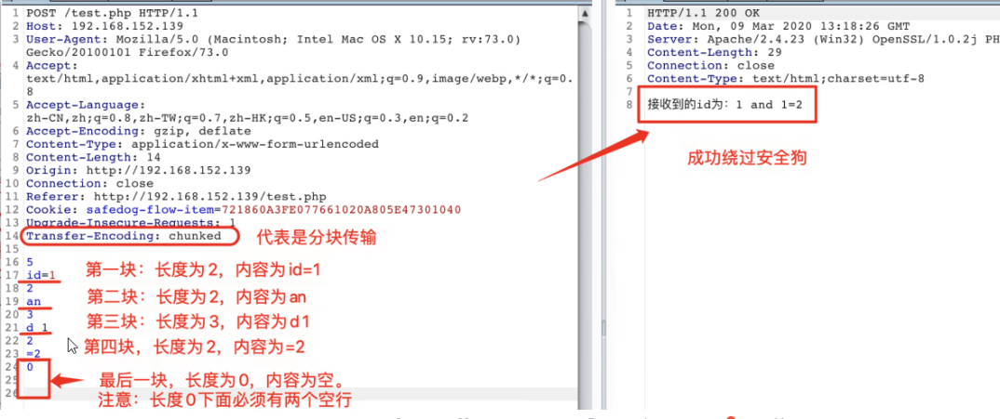

### 特殊符号

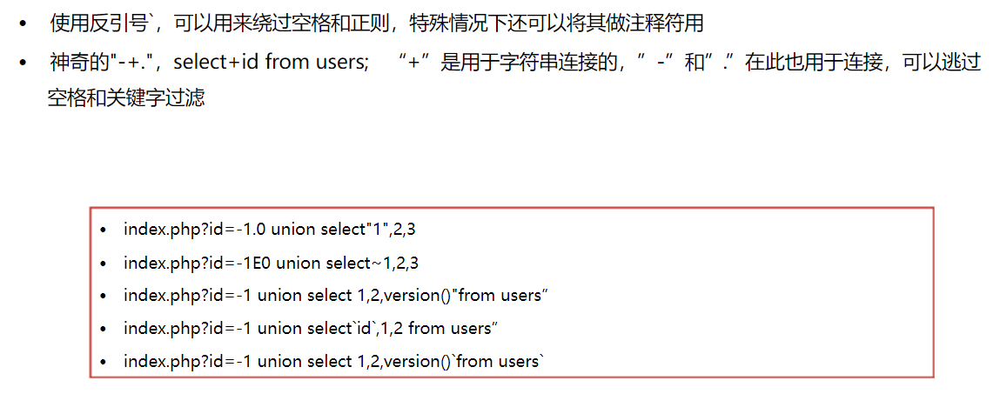

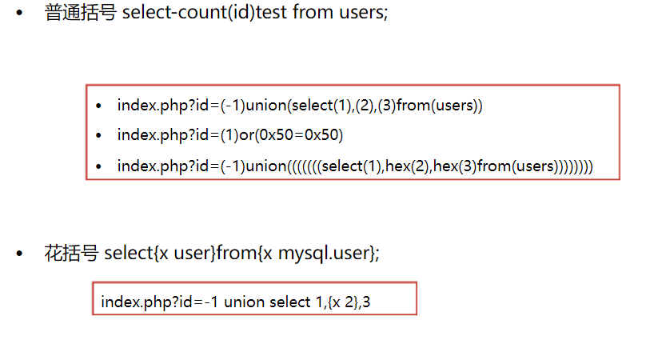

### 过滤注释符

如果#和--+注释符被过滤了，可以用永真式：or '1'='1或者 and '1'='1

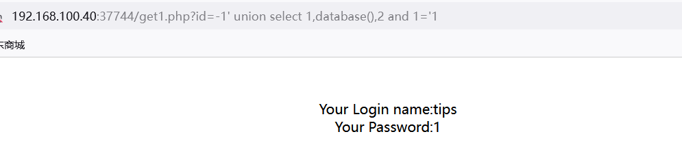

### and和or被过滤

1.关键字双写：oorr，anANDd

2.关键字替换：and：&&    or：||

### 逗号和等号被过滤

1.等号绕过方法：like代替等号

2.逗号绕过方法：使用join方法绕过，如：union select * from(select 1)a join (select 2)b join (select 3)

### union,and,or,mid,substr被过滤

使用left()函数：id%26%26ascii(left(database(),1,1))=97

### 函数过滤的绕过

1.sleep()过滤的情况下使用benchmark函数代替

2.ascii()过滤，使用ord()函数代替

3.group_concat()过滤，使用concat_ws()代替

4.substr()  mid substring 过滤，可以用left() ，right()函数代替

### 实战举例

这里过滤了union和select还有database(),所以可以在他们的中间加/*！99999 */来绕过，这个语句的意思是版本号要大于9.99.99才可以执行，这里只要记住，这个注释可以绕过，里面的数字可以是任意的5个一样的数字，查询表时，他把from给过滤了，这里我们就要对from进行处理，比如：/ * ！ %23 / * %0afrom* / 这个语句就可以绕过waf，%这个符号和url编码有关，%0a是换行，这个语句要记住，外面一个内联注释，里边一个#（%23），一个多行注释（/ *），一个换行（%0a），当他执行到多行注释时，后面再跟一个换行，他就以为后面没有东西了，也就不会去检测后面的语句了 

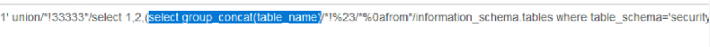

# 文件上传webshell

## 文件上传漏洞

文件上传漏洞是指程序员在开发任意文件上传功能时，并未考虑文件格式后缀的合法性校验或者是只会考虑在前端通过js经行后缀检验，这时攻击者可以上传一个与网站脚本语言相对应的恶意代码动态脚本

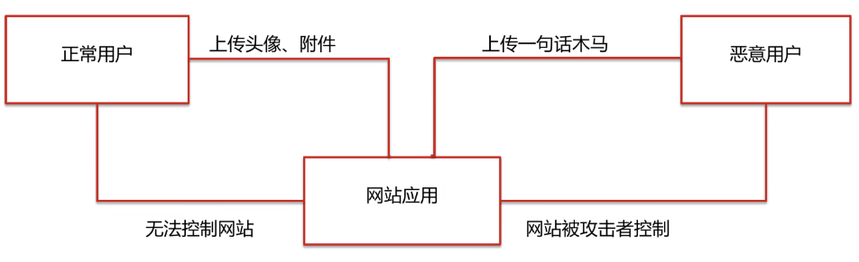

## 文件上传原理

### 漏洞成因

1.未过滤或web前后端过滤被绕过       2.文件检测被绕过      3.中间件解析

4.不完善的黑名扩列名     5.文件路径截断     6.HTTP不安全方法（PUT协议）

### 常见漏洞存在位置

1.头像，相册上传   2.视频，照片分享   3.论坛发帖，留言，邮件附件上传 

 4.添加文章图片

### 文件上传漏洞的利用条件

1.web服务器开启文件上传功能，并且上传api对外放，web用户可以访问

2.web用户对目标目录具有可写权限甚至执行权限，一般情况下，web目录都有执行权限

3.web容器可以解析上传的脚本

4.开启了PUT方法

### 文件上传漏洞的防御

#### 代码角度

1.采用白名单策略，严格限制上传文件的后缀名

2.进行二次渲染，过滤掉图片中的恶意代码

3.上传文件重命名，尽量少的从客户端上传信息

4.避免文件包含漏洞

#### 服务器角度

1.及时更新web容器，防止解析漏洞的产生

2.可写目录不给执行权限

## 文件上传的分类

### 文件任意上传

### 绕过js校验上传—前端

说明：在客户端使用js脚本判断上传的文件名是否在白名单内，如果不符合则不上传

前端绕过方法解决方法：

1.删除前端校验函数：通过修改或是删除前端校验函数来绕过

2.禁用js，通过浏览器设置停用js，从而绕过前端对文件类型的检验

### MIME-type类型绕过上传—服务器端

说明：MIME是描述消息内容类型的因特网标准，MIME消息能包含文本，图像，音频，视频以及其他应用程序专用的数据，当具有该扩展名的文件被访问时，浏览器会自动用指定的应用程序打开

常见的MIME扩张名：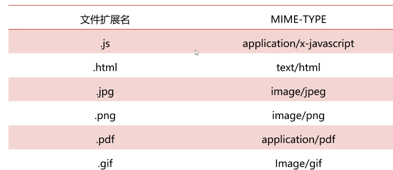

绕过方法：用bp抓包，将php文件的扩展名改为其他的扩展名

### 文件头检测—服务器端

文件头位于文件头开头的一段承担一定任务的数据，为了描述文件的一些重要属性

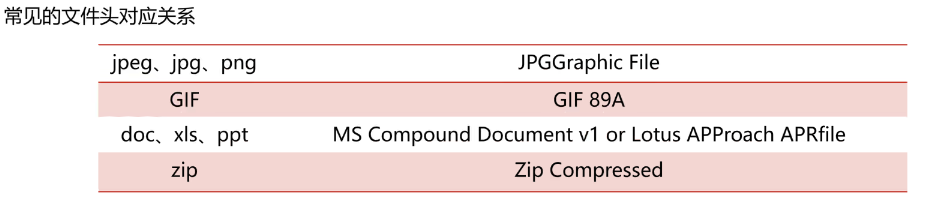

绕过方法：在php文件里面的最开始写其他文件的文件头，可以绕过一些检测

### 文件扩展名黑名单检测—服务器端

服务器端会检测文件的扩展名，在黑名单里面都扩展名就不让上传

绕过方法：

1.文件名大小写绕过，如：Php，Jsp

2.文件名双写绕过：如：.phpphp   

3.等价后缀名绕过：php3   ,    php4   ,phtml

4.空格，点号绕过：在文件扩展名后面加点或者空格

5.00截断：在url中%00表示ascii码中的0，而ascii中0作为特殊字符保留，标识字符串结束，所以当url中出现00会认为读取已结束

条件：php版本小于5.3.4，php的magic_quotes_gpc为OFF状态

举例：GET请求，知道文件上传路径

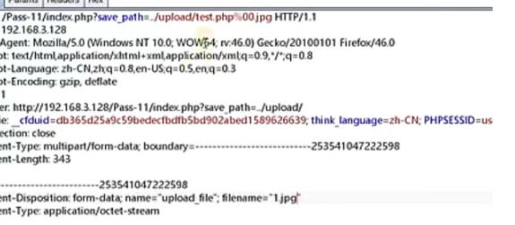

举例：将路径加上php名称和%00.jpg，下面名称那里改成合法名称

举例：POST请求，不知道文件上传路径，文件名改为1.php+.jpg因为post请求不会进行url编码，所以要将%00改成16进制0x00

6.文件流绕过:shell.php::$DATA​      shell.php:1.jpg     通过抓包改后缀名

7   .htaccess文件攻击

### 文件白名单检测绕过

#### 文件解析漏洞

文件解析：是指当服务器接收到一个http请求的时候，web容器会首先根据文件的后缀名，决定如何处理这个请求，当服务器获取到所请求的页面的后缀（.php）后，接下来就会在服务器端寻找可以处理这类后缀名的应用程序，如果找不到则直接把这个文件还给客户端

漏洞利用：由于中间件（IIS，apache）本身的缺陷，在对上传文件进行解析时出现一些不可预料的错误从而导致被利用进行文件上传绕过

常见的解析漏洞：1.apache解析漏洞     2.lls6.0解析漏洞     3.php CGI解析漏洞    4.Nginx解析漏洞

##### Apache解析漏洞

1.多后缀

存在版本：apache 1.x和apache 2.x

解析规则:从右向左开始判断，如果后缀名为不可识别文件解析，就在往左判断，如果都不认识，则会暴露其源码

举例：可以上传一个test.php.aaa.bbb文件，绕过验证且服务器依然会将其解析成php，由于apache不认识aaa和bbb，会向右一直遍历到后缀为php为止

apache能够识别的文件在mime.types文件查看

修复方案：后缀验证尽量使用白名单的方式

2.配置问题导致漏洞

漏洞产生原因：

(1).如果apache的conf里有这样一行配置AddHandler php5-script .php 这时只要文件名里面包含.php，即使文件名是test2.php.jpg也会以php来执行

(2).如果在apache的conf里有这样一行配置AddType application/x-httpd-php .jpg  即使扩展名为jpg，一样能以php方式执行

修复方案：在apache配置文件中，禁止.php.这样的文件执行，用伪静态解决，重写类似于.php.*这类文件，在apacge的httpd.conf文件中找到

3.htaccess文件解析

如果apache中.htaccess可被执行并可被上传，那么可以尝试在.htaccess中写入<FiesMatch".jpg"> SetHandler application/x-httpd-php </FilesMatch>该语句会让apache把shell.jpg文件当作php文件来解析

另一种写法是 AddType application/x-httpd-php .xxx   ,这样会把xxx文件当成php文件处理

##### IIS6.0解析漏洞

(1)目录解析

形式: /xx.asp/xx.jpg

原理：在网站下创建文件夹名字为.asp或.asa的文件夹，其目录内的任何扩展名的文件都被当作asp文件来解析并执行

(2)文件解析

形式： /x.asp;.jpg（利用特殊符号“;”）

原理:在iis6.0下，服务器默认不解析;号后面的内容，所以xx.asp;.jpg被解析为asp脚本

(3)解析文件类型

形式： /test.asa   ,  /test.cer  ,  /test.cdx

原理：iis6.0默认的可执行文件除了asp还包含三种asa，cer，cdx，会将三种扩展名文件解析为asp文件

IIS 7.0/IIS 7.5 / Nginx 1.x 畸形解析漏洞（php CGI解析漏洞）

利用条件

1.Fast-CGI运行模式

2.php.ini里cgi.fix_pathinfo=1

3.取消勾选php-cgi.exe程序的"Invoke handler only request is mapped to"

形式：如果在一个文件路劲/xx.jpg后面加上/xx.php会将/xx.jpg/xx.php解析为php文件

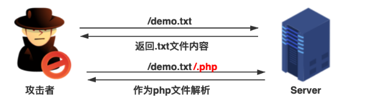

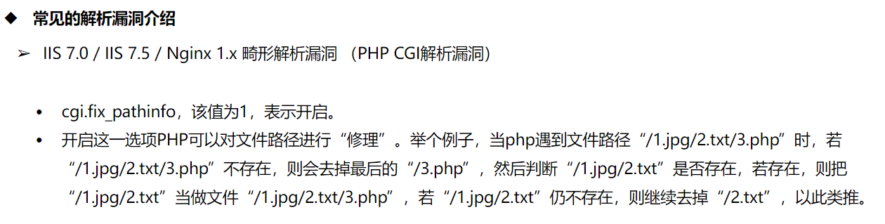

##### Nginx<8.03空字节代码执行漏洞

原理：在使用PHP-FastCGI执行php的时候，url里面在遇到%00空字节时与FastCGI处理不一致，导致可以在图片中嵌入php代码然后通过xxx.jpg%00.php来执行其中的代码

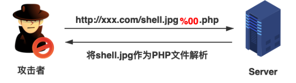

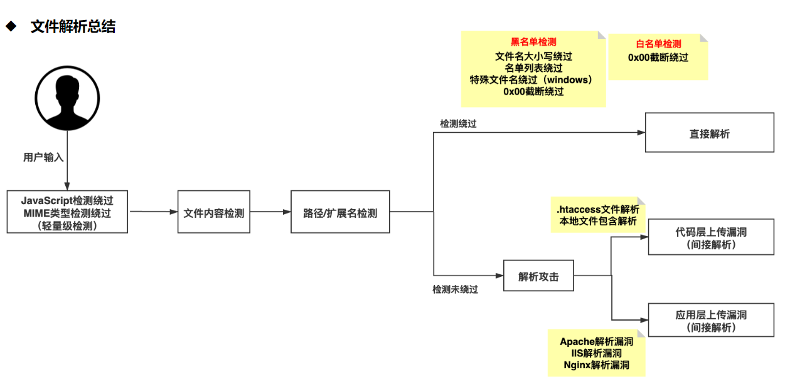

#### 配合文件包含漏洞进行绕过

### 文件加载检测—服务器端
