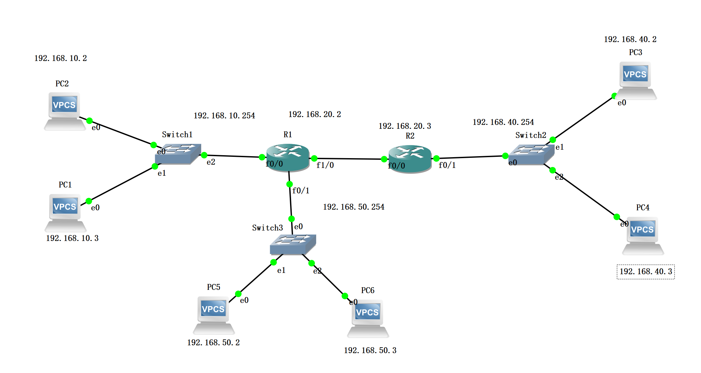
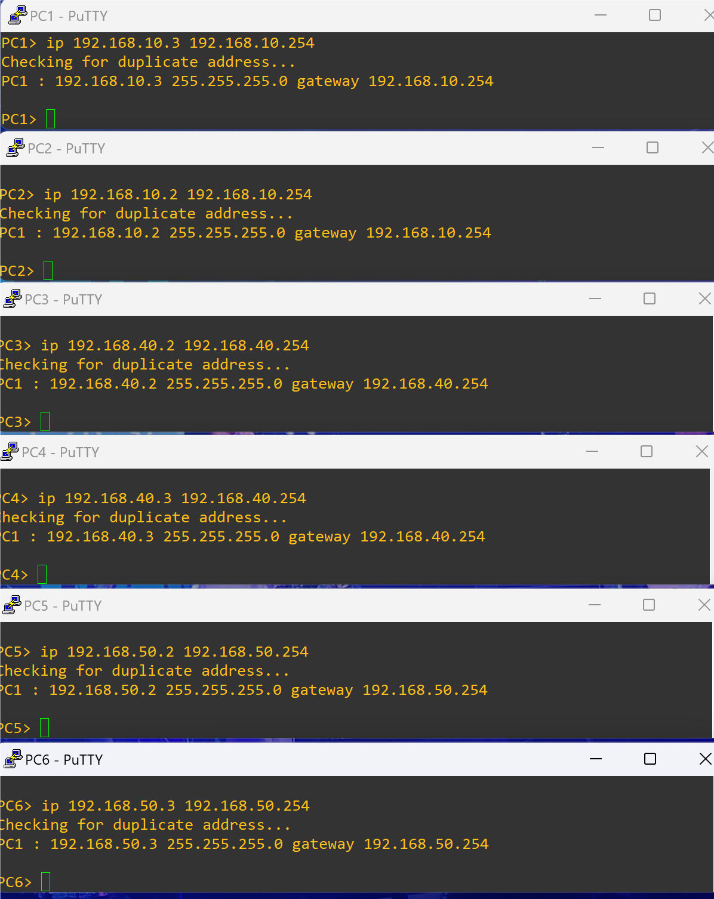
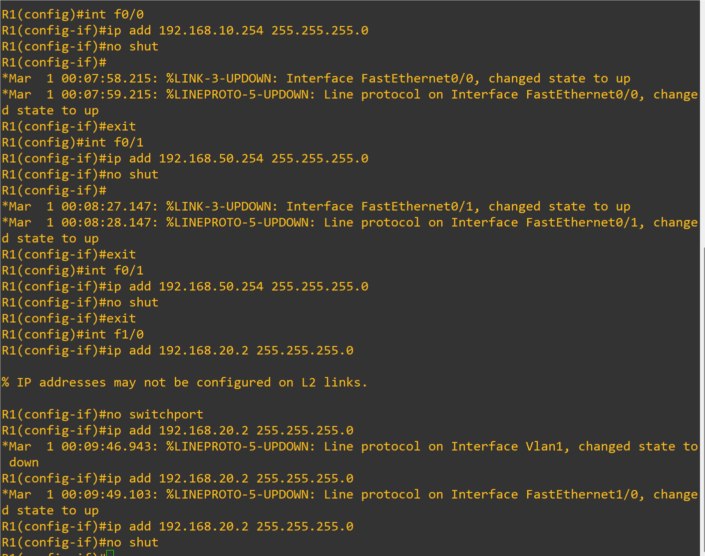
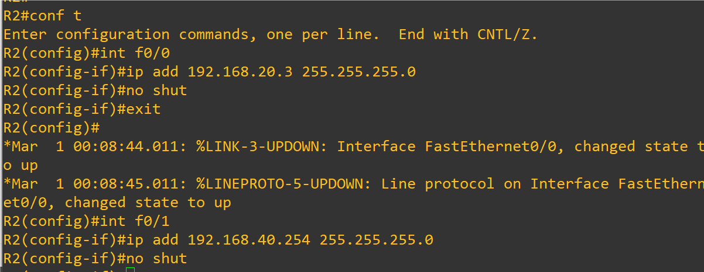
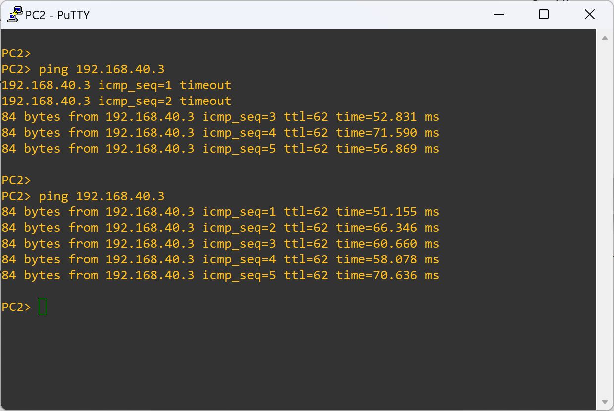

### 配置访问控制列表(ACL)

```
首先先创建如图所示视图,并连线
```


```
配置R1:
contf t
int f0/0
ip add 202.100.10.1 255.255.255.0
no shut
exit
ip route 0.0.0.0 0.0.0.0.0 202.100.10.2 //设置0.0.0.0,表示会默认寻找下一跳IP
exit

配置R2:
conf t
int f0/0
ip add 202.100.10.2 255.255.255.0
no shut
exit
int f0/1
ip add 202.100.20.1 255.255.255.0
no shut
exit

配置R3:
conf t
int f0/0
ip add 202.100.20.2 255.255.255.0
no shut
exit
ip route 0.0.0.0 0.0.0.0.0 202.100.20.1
exit
```

##### R1:


##### R2:


##### R3:


```
配置路由器R3的ACL标准

conf t
access-list 1 deny 202.100.10.1 0.0.0.0
int f0/0
ip access-group 1 in
exit
```


```
可以发现R1无法ping R3了
```


```
同理,R3 ping R1可以发现是五个'.'无法通信
```


### 案例1:

- 1.要求全部使用标准ACL控制
- 2.10网段禁止访问50网段,其他不受限制
- pc2 40.2 禁止访问50网段
- pc0 10.2 禁止访问40网段



```
配置PC1:
ip 192.168.10.3 192.168.10.254

配置PC2:
ip 192.168.10.2 192.168.10.254

配置PC3:
ip 192.168.40.2 192.168.40.254

配置PC4:
ip 192.168.40.3 192.168.40.254

配置PC5:
ip 192.168.50.2 192.168.50.254

配置PC6:
ip 192.168.50.3 192.168.50.254
```



``` 
配置完PC机以后,我们开始配置路由器

R1:
conf t
int f0/0
ip add 192.168.10.254 255.255.255.0
no shut

int f0/1
ip add 192.168.50.254 255.255.255.0
no shut

int f1/0
no switchport
ip add 192.168.20.2 255.255.255.0
no shut

R2:
conf t
int f0/0
ip add 192.168.20.3 255.255.255.0
no shut
exit

int f0/1
ip add 192.168.40.254 255.255.255.0
no shut
```

##### R1:



##### R2:



```
配置完后肯定无法通信,因为两台路由器相连需要添加静态路由

R1:
ip route 192.168.40.0 255.255.255.0 192.168.20.3

R2:
ip route 192.168.10.0 255.255.255.0 192.168.20.2
ip route 192.168.50.0 255.255.255.0 192.168.20.2
```

##### 测试

此时可以发现pc2能ping pc4了



##### 添加ACL规则

- access-list 表号 permit/deny 源IP或源网段 反子网掩码

- access-list 1 deny 10.0.0.0 0.255.255.255    //该条目用来拒绝所有源IP为10开头的主机  

- access-list 1 deny 10.1.1.1 0.0.0.0 	 //该条目用来拒绝所有源IP为10.1.1.1的主机

- Router(config)#access-list  1  deny  172.16.0.0  0.0.255.255   //创建禁止来至172.16.0.0的ACL流量

- 应用接口f0/1的**出方向(入方向in)**上

  

  

```
10网段禁止访问50网段,其他不受限制
pc2 40.2 禁止访问50网段

R1:
access-list 1 deny 192.168.10.0 0.0.0.255  // 禁止访问192.168.10.0/24网段
access-list 1 deny 192.168.40.2 0.0.0.0    // 禁止访问特定IP地址192.168.40.2
access-list 1 permit any                   // 允许所有其他流量通过
int f0/1
ip access-group 1 out                      // 将ACL 1应用于F0/1接口的出方向（即从路由器到网络的流量）

R2:
access-list 2 deny 192.168.10.2 0.0.0.0    // 禁止访问特定IP地址192.168.10.2
access-list 2 permit any                   // 允许所有其他流量通过
int f0/0
ip access-group 2 in                       // 将ACL 2应用于F0/0接口的入方向（即进入路由器的流量）
```


```
以上就完成了配置了
```

##### 测试

使用pc1访问50网段的50.2,可以发现无法访问

